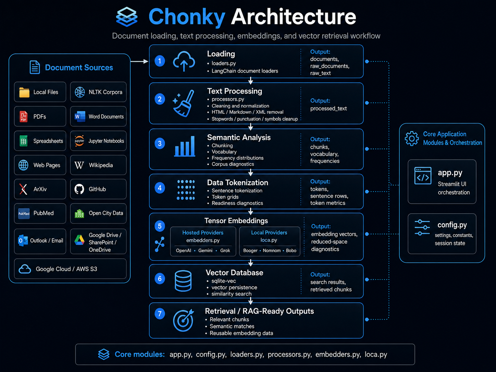

# Chonky

Chonky is a Streamlit-based document loading, text processing, embedding, and vector-search
application for working with unstructured and semi-structured text.

It provides an end-to-end workflow for loading documents, cleaning text, analyzing corpus structure,
generating embeddings, storing vectors, and retrieving semantically relevant chunks.



## 🧭 Purpose

Chonky is designed to help analysts, data scientists, and machine-learning practitioners move from
source documents to retrieval-ready outputs through a clear staged workflow.

The application supports:

| Capability        | Description                                                                                    |
| ----------------- | ---------------------------------------------------------------------------------------------- |
| Document loading  | Ingest files, corpora, notebooks, web pages, public sources, cloud objects, and email content. |
| Text processing   | Clean, normalize, parse, and transform raw text into analysis-ready text.                      |
| Semantic analysis | Generate chunks, vocabulary, frequency tables, and corpus diagnostics.                         |
| Tokenization      | Inspect sentence structure, token grids, token counts, and embedding readiness.                |
| Embeddings        | Generate hosted or local embedding vectors.                                                    |
| Vector database   | Persist vectors locally with `sqlite-vec` and run semantic similarity search.                  |
| Retrieval outputs | Return relevant chunks and semantic matches for review or downstream workflows.                |

## 🧱 Application Workflow

Chonky follows a staged document-intelligence pipeline.

```text
Document Sources
        │
        ▼
Loading
        │
        ▼
Text Processing
        │
        ▼
Semantic Analysis
        │
        ▼
Data Tokenization
        │
        ▼
Tensor Embeddings
        │
        ▼
Vector Database
        │
        ▼
Retrieval / RAG-Ready Outputs
```

Each stage produces shared application state that the next stage consumes. This keeps the workflow
inspectable and repeatable.

## 📦 Core Modules

| Module          | Purpose                                                                                                   |
| --------------- | --------------------------------------------------------------------------------------------------------- |
| `app.py`        | Streamlit interface, tab orchestration, session-state coordination, and workflow execution.               |
| `config.py`     | Application constants, paths, provider settings, model options, logging paths, and session defaults.      |
| `loaders.py`    | Document loaders for local files, corpora, web sources, cloud sources, notebooks, email, and public data. |
| `processors.py` | Text cleaning, parsing, normalization, tokenization, chunking, corpus analysis, and PDF/page processing.  |
| `embedders.py`  | Hosted embedding provider wrappers for OpenAI, Gemini, and Grok-compatible workflows.                     |
| `loca.py`       | Local GGUF embedding wrappers using `llama-cpp-python`.                                                   |

## 📥 Loading

The loading workflow converts source material into LangChain `Document` objects.

Supported source categories include:

| Category         | Examples                                                               |
| ---------------- | ---------------------------------------------------------------------- |
| Local documents  | Text, CSV, PDF, Word, Excel, PowerPoint, Markdown, HTML, JSON, XML     |
| Corpora          | NLTK Brown, Gutenberg, Reuters, WebText, Inaugural, State of the Union |
| Web sources      | Web pages, recursive crawls, Wikipedia, ArXiv, GitHub, PubMed          |
| Notebook sources | Jupyter notebooks                                                      |
| Email sources    | Outlook and email files                                                |
| Cloud sources    | Google Cloud Storage, AWS S3, Google Drive, SharePoint, OneDrive       |
| Public data      | Open City Data                                                         |

The primary loading outputs are:

```text
documents
raw_documents
raw_text
active_loader
```

## 🧹 Processing

The processing workflow prepares raw text for analysis and embedding.

Common operations include:

| Operation              | Purpose                                                      |
| ---------------------- | ------------------------------------------------------------ |
| Whitespace cleanup     | Normalize spacing, line breaks, and blank regions.           |
| HTML cleanup           | Remove HTML tags and extract visible content.                |
| Markdown cleanup       | Remove Markdown syntax while preserving text content.        |
| XML cleanup            | Extract inner text from XML-like content.                    |
| Stopword removal       | Remove common words that may not help analysis.              |
| Punctuation cleanup    | Remove or normalize punctuation patterns.                    |
| Symbol cleanup         | Remove configured symbols and formatting artifacts.          |
| Header/footer cleanup  | Remove repeated page-boundary text from extracted documents. |
| Tokenization           | Split text into words, sentences, or model tokens.           |
| Lemmatization/stemming | Normalize related word forms.                                |

The primary processing output is:

```text
processed_text
```

## 📊 Analysis

The analysis workflow helps inspect the structure and quality of processed text before embedding.

Typical outputs include:

| Output                 | Description                                                    |
| ---------------------- | -------------------------------------------------------------- |
| Chunks                 | Smaller text windows used for analysis, embedding, and search. |
| Vocabulary             | Unique term set extracted from the active text.                |
| Frequency distribution | Token counts and common-term diagnostics.                      |
| Corpus metrics         | Readability, density, token, and vocabulary measures.          |

## 🔢 Tokenization

The tokenization workflow provides diagnostics for how text is divided before embedding.

It supports:

| Diagnostic            | Purpose                                                  |
| --------------------- | -------------------------------------------------------- |
| Sentence rows         | Inspect sentence-level segmentation.                     |
| Token grids           | View fixed-width token windows.                          |
| Token counts          | Estimate input length and embedding readiness.           |
| Sparsity metrics      | Identify empty, short, or uneven token regions.          |
| Readiness diagnostics | Evaluate whether text is suitable for vector generation. |

## 🧠 Embeddings

Chonky supports both hosted and local embedding workflows.

| Provider Type    | Module         | Examples                                  |
| ---------------- | -------------- | ----------------------------------------- |
| Hosted providers | `embedders.py` | OpenAI, Gemini, Grok-compatible workflows |
| Local providers  | `loca.py`      | Booger, Nomnom, Bobo                      |

Embedding outputs can be inspected, reduced for diagnostics, and persisted for search.

## 🗄 Vector Database

Chonky uses `sqlite-vec` for local vector persistence and semantic similarity search.

The vector workflow connects embedded chunks to query-time retrieval. Users can store vectors,
search for semantically related content, and inspect retrieved chunks.

Primary outputs include:

```text
search_results
retrieved chunks
semantic matches
```

## 🚀 Run Chonky

Create and activate a virtual environment.

### Windows PowerShell

```powershell
python -m venv .venv
.\.venv\Scripts\Activate.ps1
python -m pip install --upgrade pip
python -m pip install -r requirements.txt
```

Run the application.

```powershell
python -m streamlit run app.py
```

## 📚 Build the Documentation

Chonky documentation is built with MkDocs, Material for MkDocs, and mkdocstrings.

```powershell
mkdocs build
```

To serve the documentation locally:

```powershell
mkdocs serve
```

Then open the local documentation site in the browser.

## 🧪 Validation

Before publishing documentation or source changes, run:

```powershell
python -m compileall .
mkdocs build
python -m streamlit run app.py
```

These checks confirm that the Python modules compile, the documentation builds, and the Streamlit
application launches.

## 🧾 Summary

Chonky combines document ingestion, text processing, token diagnostics, embedding generation, vector
persistence, and semantic retrieval in a single staged application.

The project is organized around clear Python modules and source-driven documentation so the
application can be used interactively while the API reference remains tied directly to the code.
